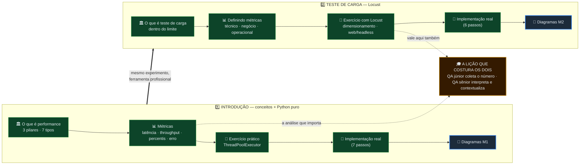

# 🗺️ Mapa Visual — Mentoria Sementes 2

> **QA · Teste de Performance · Unicred.** CONCEITOS (Módulo 1) → CARGA com Locust (Módulo 2).
> Prefere texto? [[🧭 COMECE AQUI]]. Lista completa por assunto? [[00-MOC|MOC]].

---

## O todo em um diagrama

---

## 1️⃣ Introdução a Testes de Performance

O módulo-fundação: o que é, 3 pilares, 7 tipos, métricas, 1º teste real em Python.
→ Abrir: [[modulo-1/_index|índice do Módulo 1]] · 📐 [[modulo-1/diagramas|Diagramas M1]]

| Nota | Sobre |
|---|---|
| 🏛️ [[modulo-1/01-o-que-e-performance\|O que é performance]] | 3 pilares (tempo · capacidade · recursos), por que fazer, os 7 tipos, planejamento. |
| 📊 [[modulo-1/02-metricas\|Métricas]] | Latência, throughput, percentis (p95/p99 — complementado), usuários, taxa de erro e suas causas (GIL, requests). |
| 🧪 [[modulo-1/03-exercicio-pratico\|Exercício prático]] | Simulador em Python puro (ThreadPoolExecutor), 6 partes + tabela + 6 blocos de análise. |
| 🚀 [[modulo-1/04-implementacao-real\|Implementação real]] | Aplicar no trabalho (7 passos: o quê / por quê / tipo / métricas / teste / resultado / conclusão). |

## 2️⃣ Teste de Carga

Carga ESPERADA, dentro do limite. Sai o Python puro, entra o Locust.
→ Abrir: [[modulo-2/_index|índice do Módulo 2]] · 📐 [[modulo-2/diagramas|Diagramas M2]]

| Nota | Sobre |
|---|---|
| 🏛️ [[modulo-2/01-o-que-e-carga\|O que é teste de carga]] | Carga esperada dentro do limite; detecção precoce, linha de base, planejamento de capacidade; geração de carga. |
| 📊 [[modulo-2/02-definindo-metricas\|Definindo métricas]] | Como ESCOLHER quais coletar: ambiente técnico, de negócio (SLA!) e operacional. Menos é mais. |
| 🦗 [[modulo-2/03-exercicio-locust\|Exercício com Locust]] | Dimensionamento proporcional (CCU), HttpUser/@task/wait_time, modo web + headless, leitura do CSV. |
| 🚀 [[modulo-2/04-implementacao-real\|Implementação real]] | Teste de carga no cenário do mentorado (6 passos — tipo já é fixo: carga). |

---

## 🎓 A lição que costura os dois módulos

> [!important] QA júnior vs QA sênior
> **Júnior:** "deu 5% de erro." → só COLETA o número.
> **Sênior:** "escala até 100 usuários, degrada acima disso (latência + erros), não suporta o
> pico esperado, satura com 200." → INTERPRETA e CONTEXTUALIZA.
>
> É o fecho do Módulo 1 e o objetivo de toda análise nos exercícios dos dois módulos.
> → [[modulo-1/02-metricas#🎓 O que esperar da análise do QA?|Abrir a lição]]
