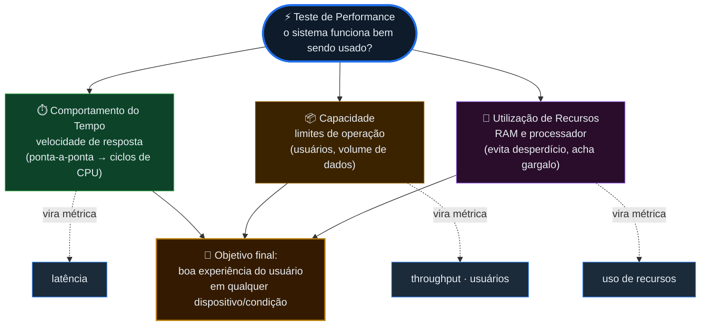
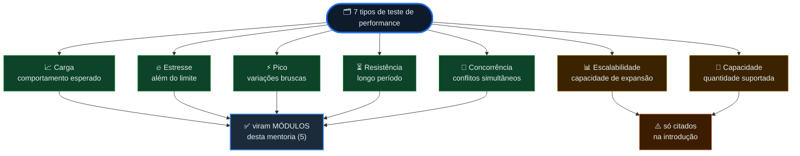
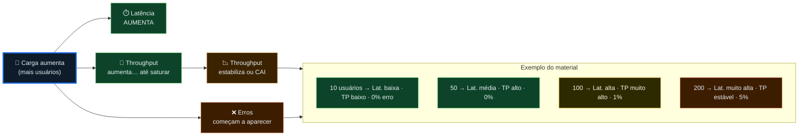
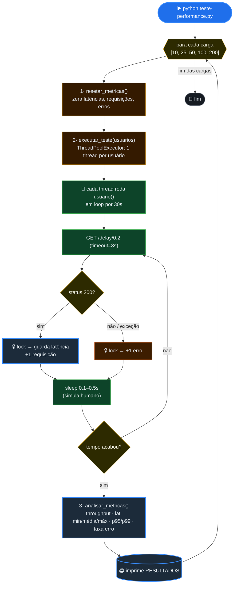
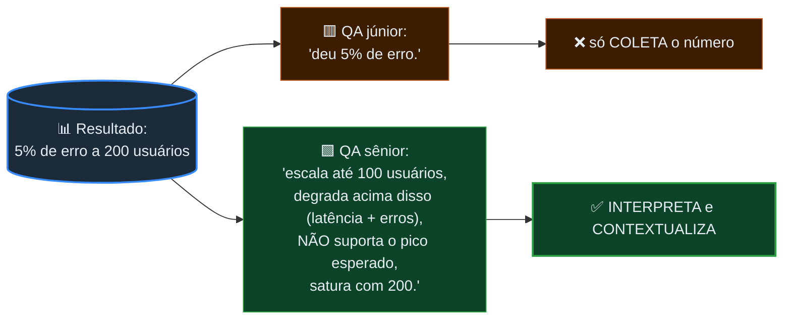

# 📐 Diagramas — Módulo 1 (Introdução a Testes de Performance)

> Versão publicada dos diagramas do Módulo 1 (os mesmos do `diagramas.canvas`, aqui em
> Mermaid para renderizar no site). Texto do módulo: [[modulo-1/_index|1️⃣ Índice do Módulo 1]].
>
> Organização: **🏛️ Conceito** (como as ideias se conectam) → **⚙️ Workflow** (o que o código
> faz, em ordem) → **🎓 A lição** (o fecho pedagógico).

---

## 🏛️ Conceito — Os 3 pilares

> Estrutura: como as ideias se conectam. Os 3 pilares (tempo · capacidade · recursos) viram
> métricas e servem ao objetivo final.

---

## 🗂️ Conceito — Os 7 tipos de teste

> Cinco dos sete tipos viram módulos da mentoria; *escalabilidade* e *capacidade* aparecem só
> citados na introdução.

---

## 🔗 Conceito — Como as métricas se relacionam sob carga

> À medida que a carga aumenta: a latência sobe, o throughput sobe até saturar, e os erros
> começam a aparecer. O exemplo numérico é o do material.

---

## ⚙️ Workflow — O fluxo do código (exercício em Python)

> Processo no tempo: o que o `teste-performance.py` faz, em ordem, para cada carga.

---

## 🎓 A lição — QA júnior vs QA sênior

> O fecho pedagógico do módulo: a diferença não é coletar o número, é interpretá-lo e
> contextualizá-lo. Detalhe em [[modulo-1/02-metricas#🎓 O que esperar da análise do QA?|📊 Métricas]].

---

## ⏭️ Para onde ir agora

- Voltar ao texto do módulo → [[modulo-1/_index|1️⃣ Índice do Módulo 1]]
- As métricas em detalhe → [[modulo-1/02-metricas|📊 Métricas]]
- Diagramas do próximo módulo → [[modulo-2/diagramas|📐 Diagramas — Módulo 2]]
