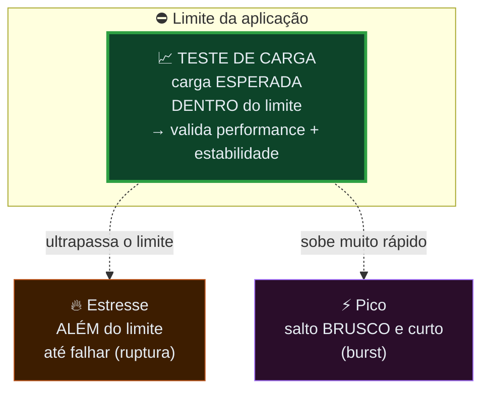
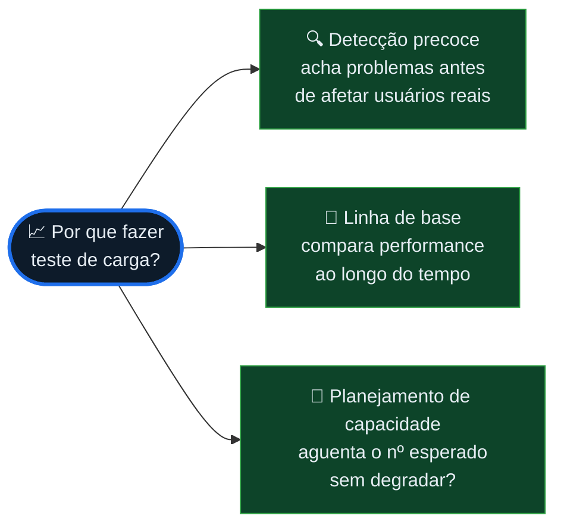
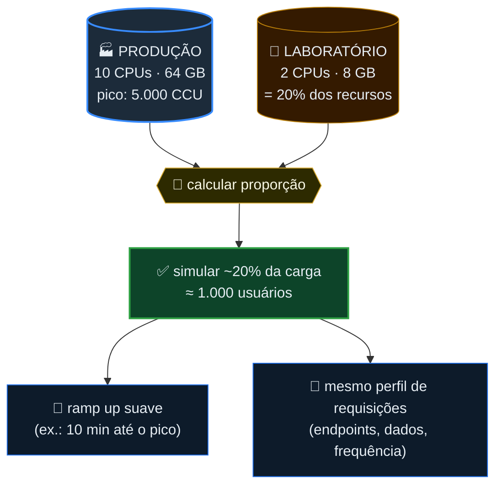
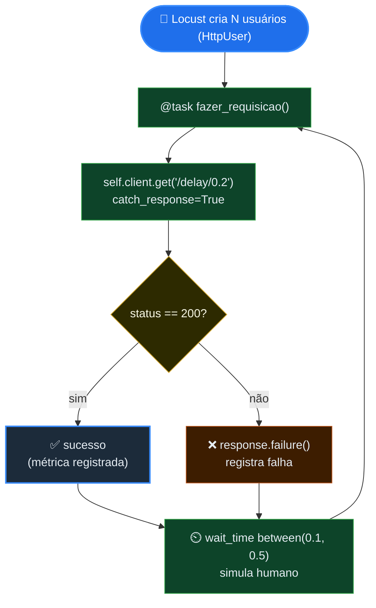
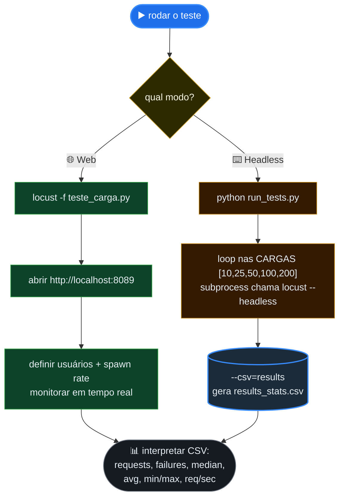

# 📐 Diagramas — Módulo 2 (Teste de Carga)

> Versão publicada dos diagramas do Módulo 2 (os mesmos do `diagramas.canvas`, aqui em
> Mermaid para renderizar no site). Texto do módulo: [[modulo-2/_index|2️⃣ Índice do Módulo 2]].
>
> Organização: **🏛️ Conceito** (onde a carga se posiciona) → **⚙️ Workflow** (o Locust em ação).

---

## 🏛️ Conceito — Carga vs Estresse vs Pico

> Estrutura: onde a carga se posiciona. O teste de carga fica **dentro** do limite da
> aplicação; estresse vai além, pico sobe brusco.

---

## 📈 Conceito — Por que fazer teste de carga

> Os três motivos do material: detecção precoce, linha de base e planejamento de capacidade.

---

## 📐 Conceito — Dimensionamento proporcional

> A regra de ouro: simule uma fração da carga de produção proporcional aos recursos do
> laboratório, com ramp up suave e o mesmo perfil de requisições.

---

## ⚙️ Workflow — O ciclo de um usuário Locust

> Processo no tempo: o que cada usuário (`HttpUser`) faz em loop, do GET ao `wait_time`.

---

## ⚙️ Workflow — Como executar (web vs headless)

> Os dois modos de rodar: interface web em tempo real, ou headless em lote gerando CSV.

---

## ⏭️ Para onde ir agora

- Voltar ao texto do módulo → [[modulo-2/_index|2️⃣ Índice do Módulo 2]]
- O exercício com Locust → [[modulo-2/03-exercicio-locust|🦗 Exercício com Locust]]
- Diagramas do módulo anterior → [[modulo-1/diagramas|📐 Diagramas — Módulo 1]]
